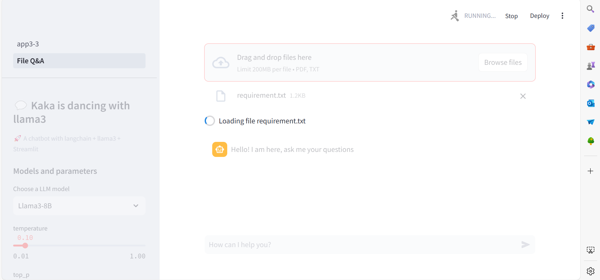
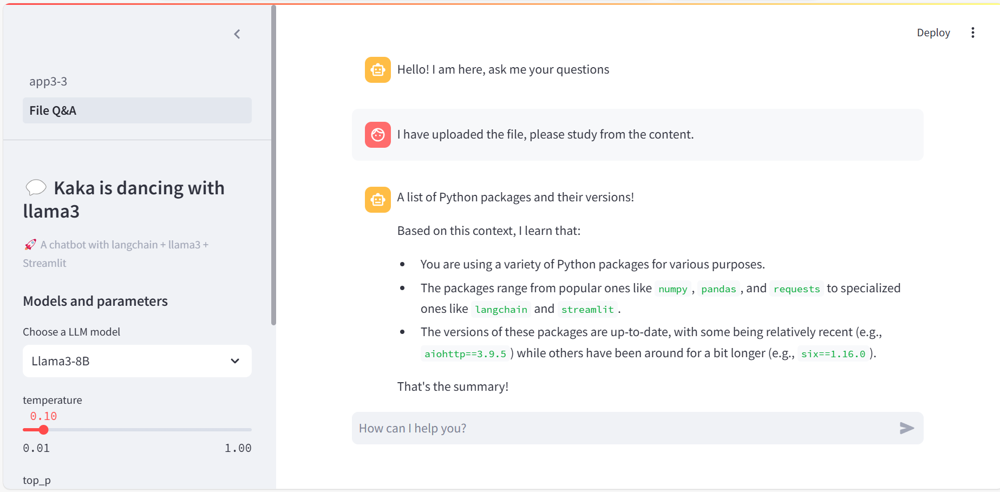
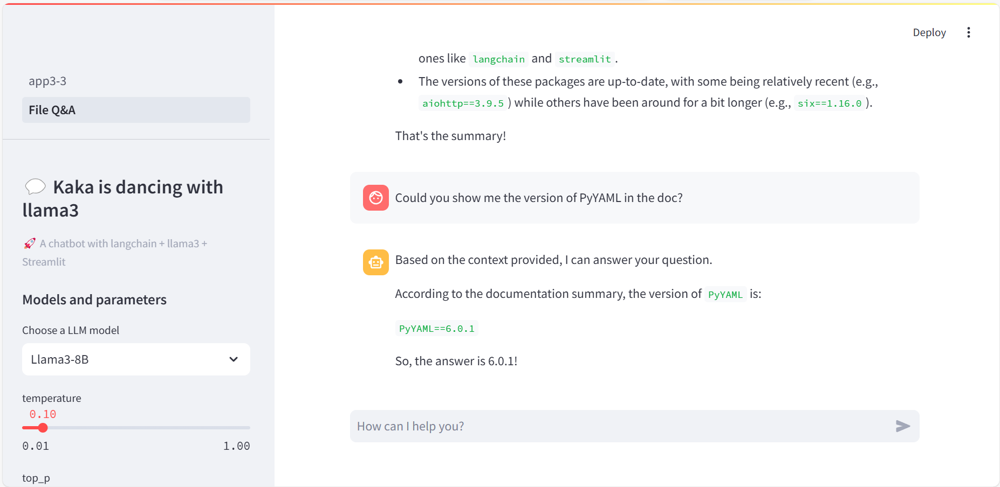

# GenAI

1. Start the server on your local machine:
ollama server

2. Pull the models if don't have on local machine:
ollama pull llama3:8b

ollama pull qwen2:7b
...
3. Run the models:
ollama run llama3:8b

ollama run qwen2:7b
...

4. If want to run multiple modeules,before starting ollama server:
set OLLAMA_MAX_LOADED_MODELS=(Number)

5. check models are running:
ollama ps

Screenshot:

